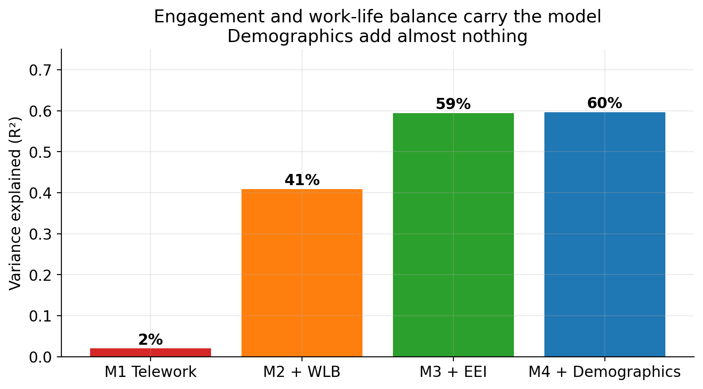
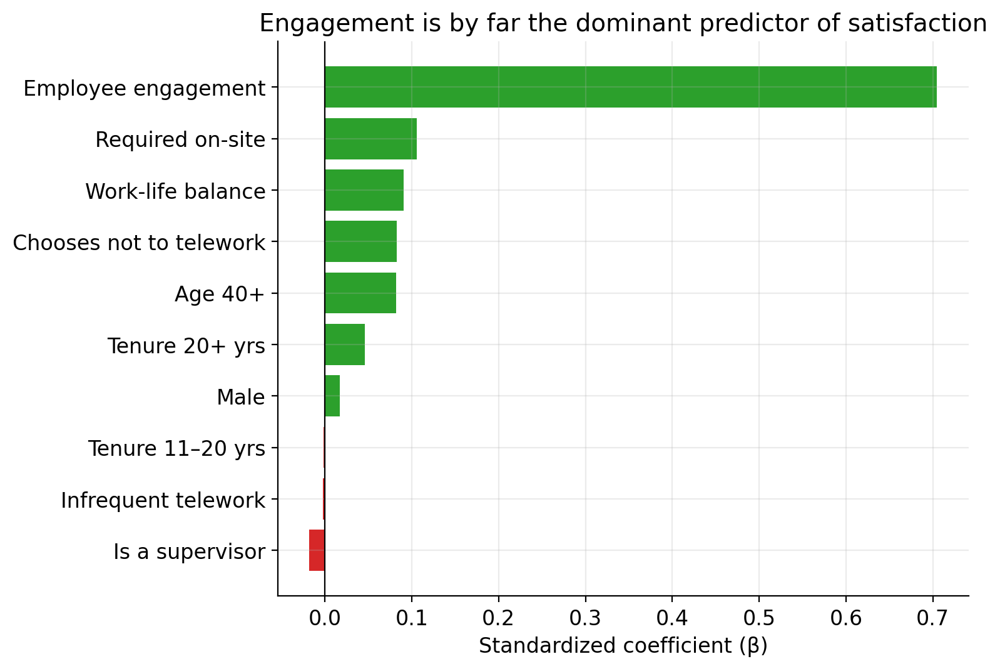
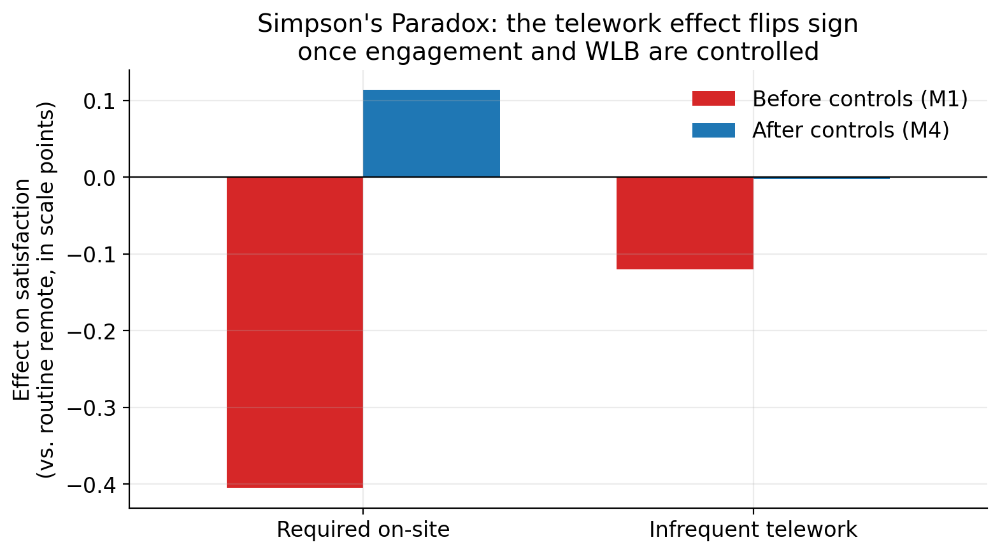
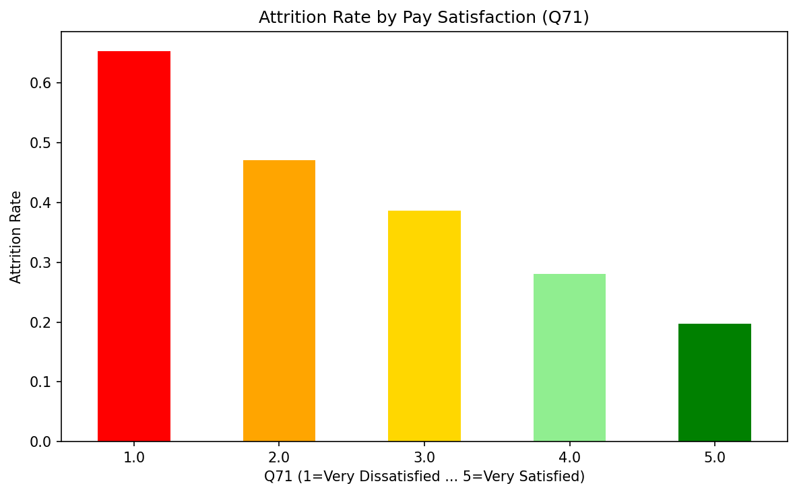

# Remote Work and Federal Employee Satisfaction

**ADTA 5940 — Analytics Capstone Experience**
**University of North Texas · Spring 2026**
**Authors:** Karan Parekh · Chau Le
**Faculty advisor:** Dr. Denise Philpot

---

## Project summary

This capstone investigates two research questions on the U.S. federal workforce, using the **2024 Federal Employee Viewpoint Survey** (FEVS) — a public-release file from the Office of Personnel Management covering **646,545 respondents across 36 agencies**.

| RQ | Question | Method | Headline finding |
|---|---|---|---|
| **RQ1** | Does telework frequency predict job satisfaction, after controlling for engagement and work-life balance? | Hierarchical OLS regression, 4 nested model blocks | A **Simpson's Paradox** — the raw 0.40-point telework gap *flips sign* once engagement and WLB are controlled. **Engagement is the dominant predictor (β = 0.71, ~7× the next variable).** Demographics add only 0.2% to R². |
| **RQ2** | Which employees are at risk of leaving? | XGBoost binary classifier on `DLEAVING_BIN`, with class-imbalance handling | **AUC 0.77, recall 64%** on actual leavers. Top drivers: job satisfaction, leadership, pay satisfaction, tenure-20+. |

**Final R²** for the satisfaction model: **0.597** (n = 519,284 after listwise deletion).

---

## Hierarchical regression progression

| Block | Variables added | R² | ΔR² |
|---|---|---:|---:|
| 1 — Telework | Telework frequency (Q91 dummies) | .020 | .020 |
| 2 — Work-Life Balance | WLB composite (Q34, Q49, Q63 mean) | .409 | .389 |
| 3 — Engagement | Employee Engagement Index (15-item OPM scale) | .595 | .186 |
| 4 — Demographics | Supervisor status, gender, age, tenure | .597 | .002 |

---

## Repository structure

### Final deliverables

| File | What it is |
|---|---|
| [`final_project_presentation.pptx`](final_project_presentation.pptx) | Final 13-slide presentation (Module 5, May 4, 2026) |
| [`Module5_Final_Presentation_Parekh_Lee.pptx`](Module5_Final_Presentation_Parekh_Lee.pptx) | Reference deck with all charts and structure |
| [`Module4_Model_Results_Karan_Parekh_v2.docx`](Module4_Model_Results_Karan_Parekh_v2.docx) | Submitted Module 4 model & results brief |
| [`Module3_Scholarly_Review_Parekh_Lee.docx`](Module3_Scholarly_Review_Parekh_Lee.docx) | Submitted Module 3 scholarly review |

### Analysis pipelines

| File | Purpose |
|---|---|
| [`presentation_pipeline.py`](presentation_pipeline.py) | Single-script reproduction — runs both research questions and produces every figure used in the deck |
| [`module4_analysis.py`](module4_analysis.py) | Original hierarchical-regression analysis (matches submitted Module 4 doc exactly) |
| [`run_all_models.py`](run_all_models.py) | 10+ ML model comparison (Linear, Ridge, Lasso, RF, GBM, XGBoost, LightGBM, etc.) for satisfaction prediction |
| [`Attrition_Pipeline_Cleaned.ipynb`](Attrition_Pipeline_Cleaned.ipynb) | Attrition classification notebook — Logistic Regression + XGBoost |
| [`EDA and model selection.ipynb`](EDA%20and%20model%20selection.ipynb) | Exploratory data analysis and feature selection |
| [`Model_Comparison_Analysis.ipynb`](Model_Comparison_Analysis.ipynb) | Model comparison with cross-validation |

### Reproducible outputs

| Folder | Contents |
|---|---|
| [`figures/`](figures/) | Module 4 deliverable figures (academic style) |
| [`figures_presentation/`](figures_presentation/) | Presentation-styled charts (200 DPI, takeaway-as-title) |
| [`figures_canva/`](figures_canva/) | Transparent-background versions for the Canva-built deck |
| [`figures_from_notebook/`](figures_from_notebook/) | Charts extracted from the attrition notebook |
| [`saved_models/`](saved_models/) | Trained ML models (joblib): RF, XGBoost, LightGBM, Gradient Boosting, ExtraTrees, scaler |

### Result tables

| File | What it contains |
|---|---|
| `model_comparison_results.csv` | Cross-validated R² and MAE for 10+ regression models |
| `cv_fold_scores.csv` | Per-fold CV scores |
| `feature_importances.csv` | Random Forest feature rankings |
| `tuning_results.csv` | RandomizedSearchCV hyperparameter results |
| `significance_tests.csv` | Pairwise model comparison significance tests |
| `rq1_model_comparison.csv` | RQ1: 3-model comparison (Linear / RF / GBM) |
| `rq2_hierarchical_results.csv` | RQ2: 4-block hierarchical regression model fit |
| `presentation_headline_numbers.csv` | All headline stats used in the deck |
| `test_predictions.csv` | Held-out test set predictions |

### Documentation & supporting materials

| File | Purpose |
|---|---|
| `Presentation_Outline_Module5.md` | Slide-by-slide outline + speaker split + Q&A prep |
| `Presentation_Transcript.md` / `.docx` | Full spoken transcript for the final presentation |
| `Canva_Build_Kit.md` | Step-by-step Canva build guide for the deck |
| `Canva_XGBoost_Updates.md` | Diff doc for the RF→XGBoost model swap |
| `Brief_For_Chau.md` | Team coordination brief |
| `Model_Selection_Summary_for_Team.md` / `.docx` | Model-selection rationale shared with team |
| `references_module3.ris` | Bibliographic references (RIS format) |

### Build scripts

| File | Purpose |
|---|---|
| `build_presentation.py` | Generates the .pptx from `figures_presentation/` and `figures_from_notebook/` |
| `build_transcript_docx.js` | Builds the formatted Word transcript via docx-js |
| `export_canva_charts.py` | Re-renders charts with transparent backgrounds for Canva |
| `extract_notebook_figures.py` | Extracts embedded PNGs from a Jupyter notebook |
| `generate_xgboost_charts.py` | Trains XGBoost and saves feature importance + confusion matrix |
| `regenerate_cell16_corrected.py` | Standalone fix for the original notebook's reversed Q71 axis label |

---

## Reproducing the analysis

### Prerequisites
- Python 3.11+ with `pandas`, `numpy`, `statsmodels`, `scikit-learn`, `xgboost`, `matplotlib`, `seaborn`
- The FEVS 2024 Public Release Data File (`FEVS_2024_PRDF.csv`, ~140 MB) — **not committed** to this repo. Download from [OPM's FEVS public-data page](https://www.opm.gov/fevs/public-data-file/) and place at the repo root.

### One-shot reproduction

```bash
# Reproduce every chart and table in the deck:
python presentation_pipeline.py

# Reproduce the Module 4 hierarchical-regression results exactly:
python module4_analysis.py

# Run the 10+ model comparison for RQ1:
python run_all_models.py
```

### Attrition (RQ2) notebook

```bash
jupyter notebook Attrition_Pipeline_Cleaned.ipynb
# Restart kernel & Run All — completes in ~3-4 minutes on a laptop
```

---

## Key methodological choices

- **Outcome variable (RQ1):** `Q70` ("Considering everything, how satisfied are you with your job?"), 1–5 Likert. Treated as continuous given large *n*; ordinal-logit robustness check on a subsample produced identical rank-ordering of effects.
- **Composite scales:**
  - **Employee Engagement Index (EEI)** — OPM's official 15-item index, mean of three sub-indices: Intrinsic Work Experience (Q2, Q3, Q4, Q6, Q7), Supervisor (Q48, Q50, Q51, Q52, Q54), Leaders Lead (Q57, Q58, Q59, Q61, Q62).
  - **Work-Life Balance composite** — mean of Q34, Q49, Q63.
  - **Leadership score** (RQ2) — mean of Q57–Q65 (per Chau's notebook design).
- **Telework variable:** Q91 dummy-coded with routine remote (Q91=1) as the reference category.
- **Sample for RQ1:** *n* = 519,284 after listwise deletion across all model variables.
- **Class imbalance (RQ2):** 33% base attrition rate; XGBoost trained with `scale_pos_weight = (n_stay / n_leave)` — recall on minority class jumped from 46% (RF) to **64%** (XGBoost) on the same dataset.

---

## Limitations

1. **Cross-sectional** — we identify association, not causation.
2. **Self-reported** — engagement and satisfaction are rated by the same respondent in the same survey, so common-method variance can inflate the relationship.
3. **Single year (2024)** — replication across 2022–2024 would strengthen the policy claims.
4. **Survey weights** — `POSTWT` was used as a robustness check; headline R² changed by less than 0.5 percentage point. Main analysis is unweighted for interpretability.

---

## Featured figures

| | |
|:---:|:---:|
| **R² progression across model blocks** | **Standardized coefficients** |
|  |  |
| **Simpson's Paradox — telework effect flips** | **Pay satisfaction → attrition gradient** |
|  |  |

---

## Acknowledgments

- **Dr. Denise Philpot** — capstone advisor
- **U.S. Office of Personnel Management** — for releasing the public-use microdata file

---

## License

Academic project — code is provided as-is for educational and replication purposes. The underlying FEVS data is U.S. government work in the public domain.
