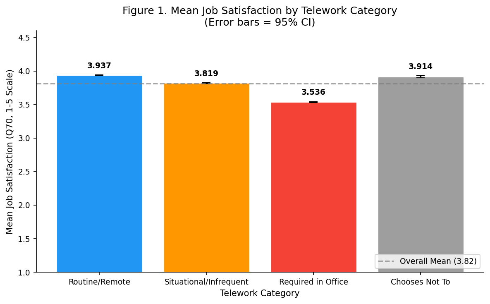
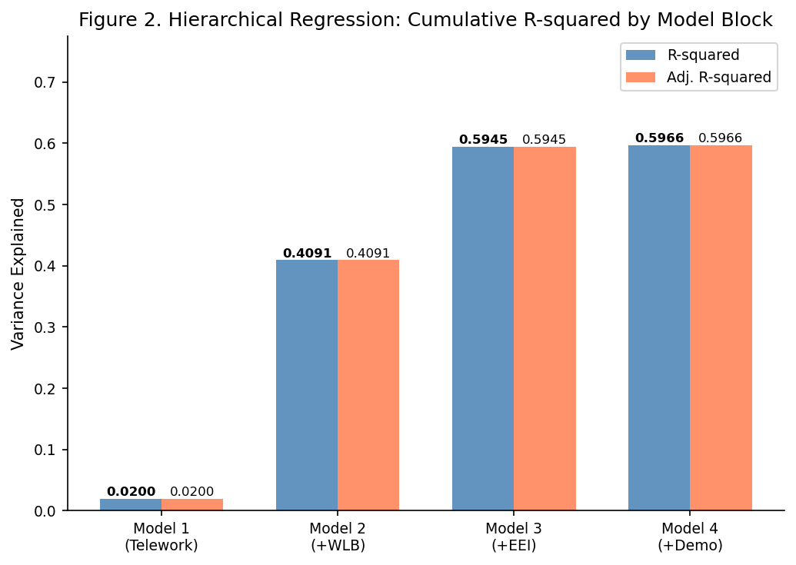
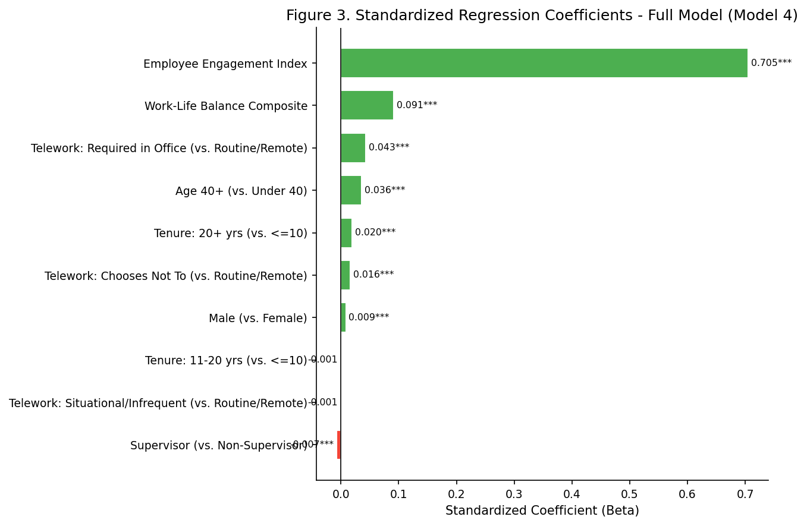
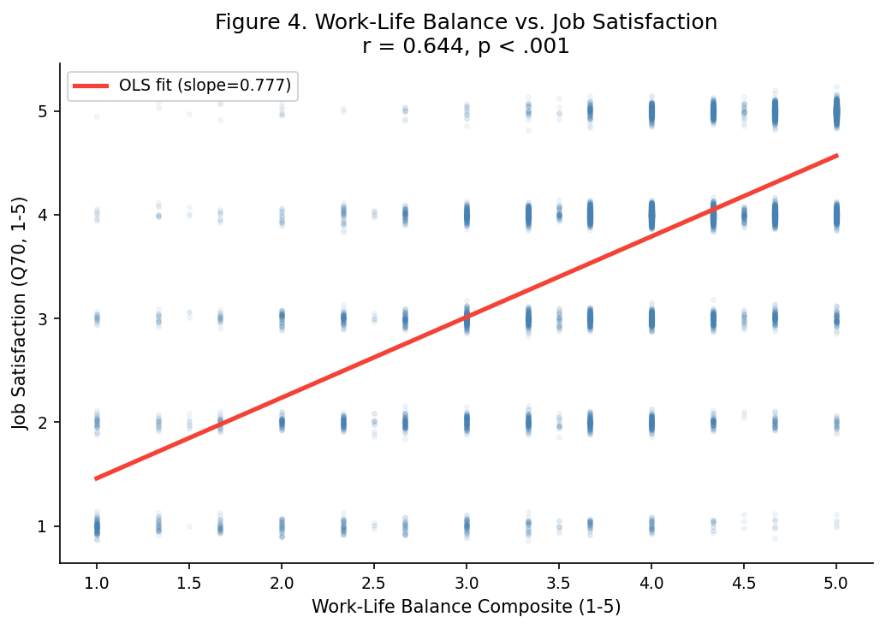
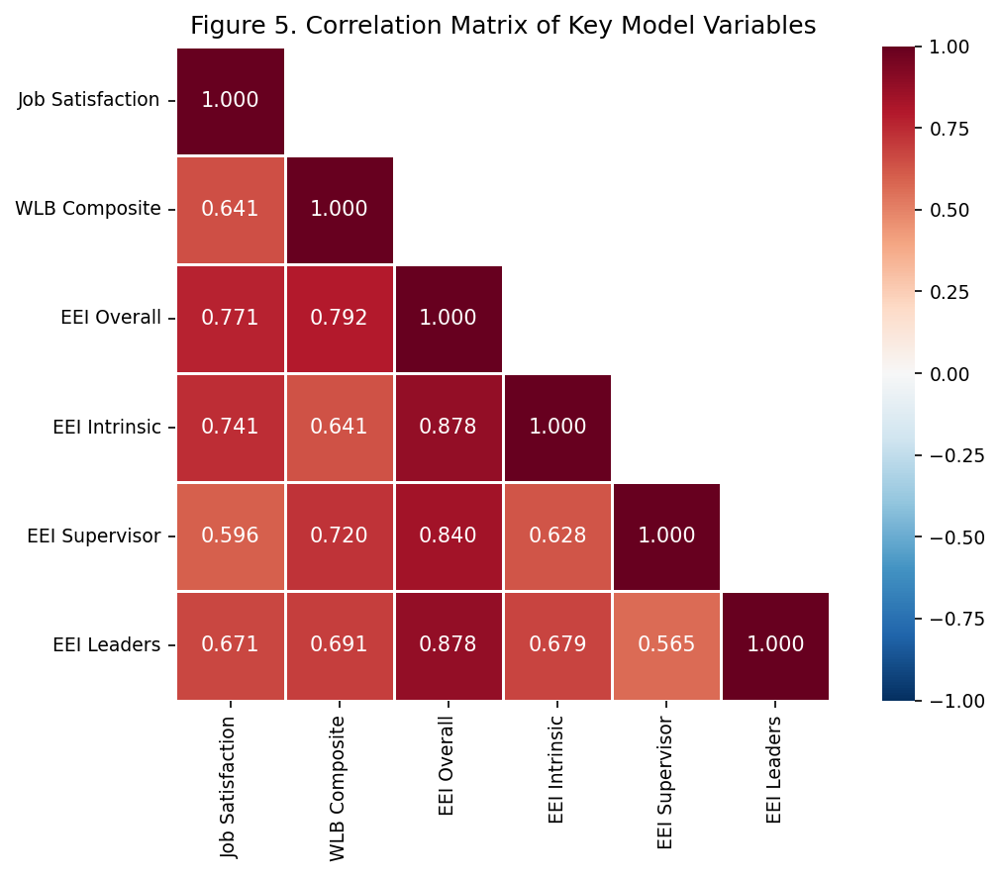
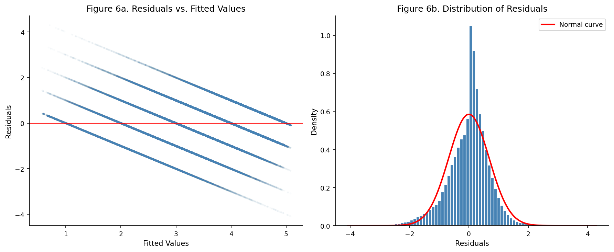

# ADTA 5940 — Federal Employee Job Satisfaction: A Hierarchical Regression Analysis

> **Course:** ADTA 5940 · Analytics Capstone Experience · University of North Texas  
> **Data:** [2024 Federal Employee Viewpoint Survey (FEVS)](https://www.opm.gov/fevs/) — 646,444 records

## Research Question

> To what extent does telework frequency predict overall job satisfaction among federal employees, after controlling for work-life balance perceptions, employee engagement, and demographic characteristics?

## Approach

**Hierarchical OLS Regression** built in four blocks to isolate the incremental contribution of each predictor group:

| Block | Variables Added | R² | ΔR² |
|-------|----------------|-----|------|
| 1 — Telework | Telework frequency (4 categories) | .014 | .014 |
| 2 — Work-Life Balance | WLB satisfaction score | .317 | .303 |
| 3 — Engagement | Employee Engagement Index (EEI) | .597 | .280 |
| 4 — Demographics | Supervisory status, agency size, tenure | .597 | <.001 |

## Key Findings

- **R² = .597** — the final model explains ~60% of variance in job satisfaction
- **Simpson's Paradox discovered:** telework shows a *positive* bivariate association with satisfaction, but the coefficient **reverses sign** once WLB and engagement are controlled — remote workers are slightly *less* satisfied after adjustment
- **EEI is the dominant predictor** (β = 0.705) — engagement alone accounts for 28 percentage points of explained variance
- **Demographics add virtually nothing** (ΔR² < .001) once attitudinal factors are included
- Analytic sample: **517,697 complete cases** after listwise deletion

## Figures

| | |
|:---:|:---:|
|  |  |
|  |  |
|  |  |

## Repository Structure

```
├── module4_analysis.py                    # Full hierarchical OLS pipeline
├── Module4_Model_Results_Karan_Parekh.md  # Detailed research report
├── ocr_extract.py                         # Utility for codebook extraction
└── figures/
    ├── fig1_satisfaction_by_telework.png
    ├── fig2_r2_progression.png
    ├── fig3_coefficients_forest.png
    ├── fig4_wlb_vs_satisfaction.png
    ├── fig5_correlation_heatmap.png
    └── fig6_diagnostics.png
```

## Tech Stack

`Python` · `statsmodels` · `pandas` · `matplotlib` · `seaborn` · `scipy`

## How to Reproduce

```bash
# Download FEVS 2024 PRDF from https://www.opm.gov/fevs/
# Place FEVS_2024_PRDF.csv in the project root, then:
python module4_analysis.py
```

> The FEVS dataset is publicly available from OPM and not included in this repo due to size (~200 MB).
